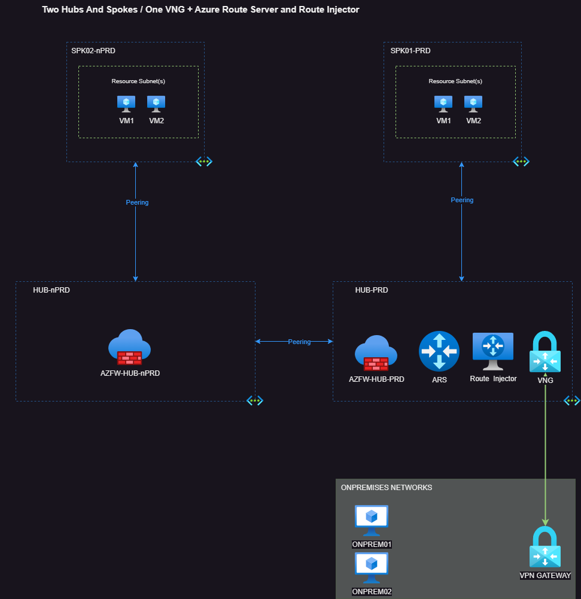
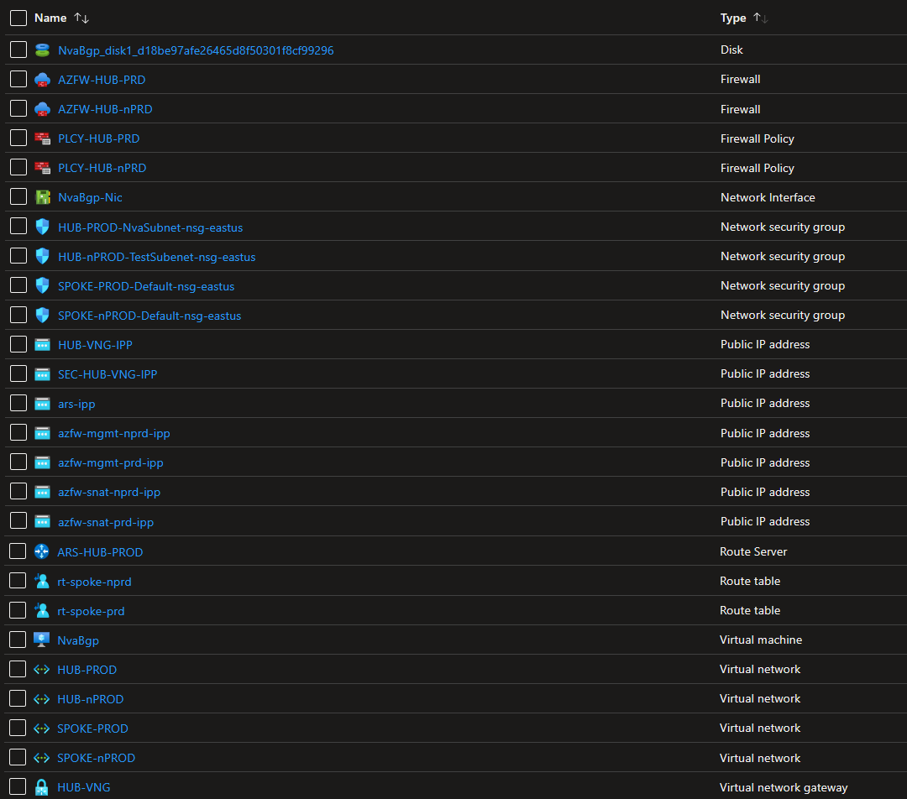
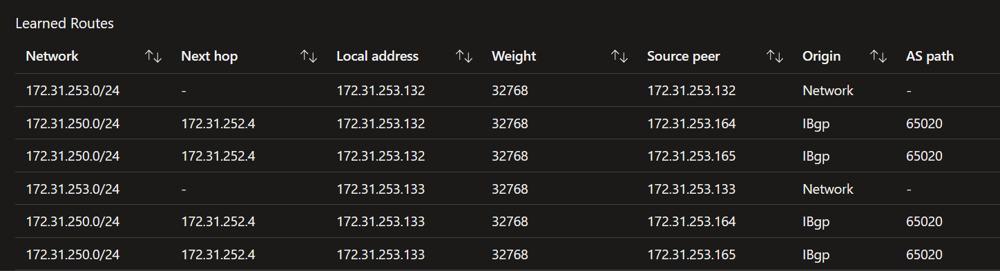

## Two HUBS & Spokes With Azure Firewall + Azure Route Server + Nva with BGP
### Description:

*Disclaimer*: This lab is not a recommendation; it's an exercise.

The main goal of this test/lab is to practice with Azure Route Server and observe its versatility.

This topology consists of Spokes using Azure as the default gateway through Peerings and UDRs.

The Virtual Network Gateway will only advertise the IPv4 prefixes from PROD-HUB and PROD-Spokes.

The idea is to use an Azure Route Server and NVA to reflect routes from NPROD Spokes (located behind NPROD-HUB) to the Virtual Network Gateway and to on-premises if you have a VPN connection.

To achieve this, we need to configure the Azure Route Server in Branch to Branch mode, which will automatically set up iBGP between ARS and VNG.

Last but not least, we need to configure our NVA to inject NPROD Spokes Network into ARS, pointing this route to the Azure Firewall from NPROD HUB.

Don't worry - we have a shell script to handle all these tasks for us.

*Grab a coffee, mate! Let's route the cloud*.

### The Big Picture explained: 

##### Azure Resources:
    • 2x HUBS VNETS (PROD and nPROD) 
    • 2x Spokes VNETS (PROD and nPROD)
    • 2x Azure Firewalls (one of each HUB)
    • 1x Azure Route Server (HUB PROD) 
    • 1x Virtual Network Gateway
    • 1x Linux Virtual Machine with Quagga software for BGP Service
    
*On-premises Side is just for ilustrate*.

##### How to Deploy all these Resources?

I have created a shell script that automates the deployment of all the necessary resources to build this topology.

You can find the script here:[MHubs-Spokes-ARS-Injector-Deployment.sh](../shell/mhub-spk-ars-nvabgp.sh)

##### Basic Guidance to use this script: 
    • Before running the script, ensure that you have logged in to Azure CLI and configured the appropriate Azure account.
    • To start the deployment in Azure, simply execute the script using the command ./script.sh.
    • If you want to clean up all resources without confirmation prompts, use ./script.sh CLEAN.
    • Make sure you have the Azure Firewall extension for Azure CLI installed. If not, you can add it by running the command az extension add --name azure-firewall.
    • Please note that the deployment of Azure Route Server may take some time, typically around 30 minutes.
    • The Virtual Network Gateway will be deployed with the --no-wait option. This means that although the script will finish, the VNG status will remain as "Updating" for approximately 40 minutes.
    • It is highly recommended to delete the lab at the end of the day to minimize costs.
       
##### Resources created by this script: 
  
  
 
 
##### Results / Learnings : 
After the deployment process is completed, go to the Virtual Network Gateway and observe the BGP Peers. What should we expect?

Routes from nPRD Spoke with ASPath originating from our NVA.

This route should be directed towards the private IP of the nPRD HUB Azure Firewall.

Exciting news! We now have a route injector in place!

Thank you for joining this journey, and see you in the next one!

 
